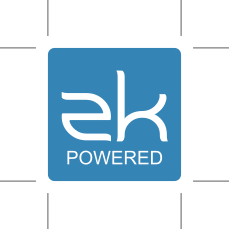
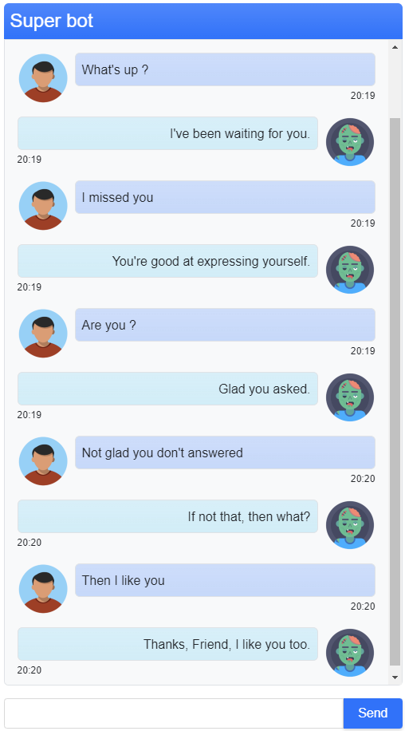
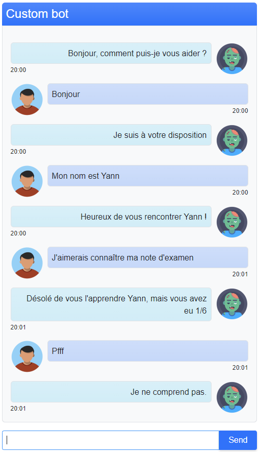

# Minimal AIML chatbot

Minimal chatbot using **Program AB** implementation of the **AIML 2.0** draft specification.


[](https://jdk.java.net/17/)
[](https://spring.io/projects/spring-boot)
[](https://www.zkoss.org/)
[](https://getbootstrap.com/)

---

# Table of Contents

* [About the Project](#about-the-project)
* [Installation](#installation)
* [Usage](#usage)
* [License](#license)

# About the project

<table>
  <tr>
    <td>
        
    </td>
    <td>
        
    </td>
    <td>
        
    </td>
    <td>
        
    </td>
  </tr>
</table>

This program provides a minimal **Spring Boot** application with a **ZK** frontend allowing to interact with a rule-based chatbot easily.

It uses the **Program AB** library : <https://code.google.com/archive/p/program-ab/>

This project is for testing purpose. The custom bot is very basic and just understand some French sentences, the goal was to test some minimal interactions,
not to have a complete production-ready chatbot.

# Installation

1. Clone the repository :
    ```shell script
    git clone https://github.com/Yann39/aiml-chatbot
    ```
2. Build the JAR file using **Maven** :
   ```shell script
   mvn clean package
   ```
3. Execute application from Intellij or run the JAR file :
   ```shell script
   java -jar /target/eth-hash-app.jar
   ```
4. Reach <http://localhost:8080/>

# Usage

There are 2 bots :

- `super` : the default provided bot with the Program AB library.
- `custom` : our custom bot

You can change the bot by changing the `BOT_NAME` constant in the main view model (`MainVm`).

Then simply run the program and reach <http://localhost:8080>.

<table>
  <tr>
    <td>
      
    </td>
    <td>
      
    </td>
  </tr>
</table>

# License

[General Public License (GPL) v3](https://www.gnu.org/licenses/gpl-3.0.en.html)

This program is free software: you can redistribute it and/or modify it under the terms of the GNU
General Public License as published by the Free Software Foundation, either version 3 of the
License, or (at your option) any later version.

This program is distributed in the hope that it will be useful, but WITHOUT ANY WARRANTY; without
even the implied warranty of MERCHANTABILITY or FITNESS FOR A PARTICULAR PURPOSE. See the GNU
General Public License for more details.

You should have received a copy of the GNU General Public License along with this program. If not,
see <http://www.gnu.org/licenses/>.